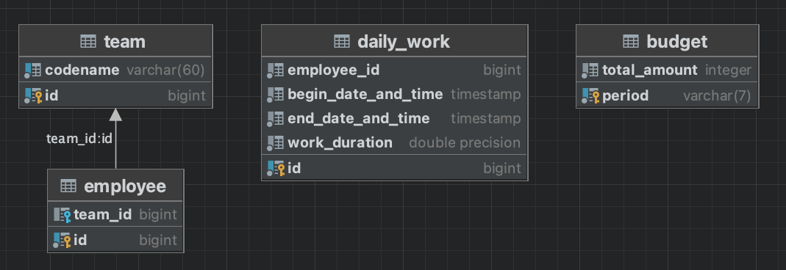

## Краткая логика работы:
Для работы приложения создаются 4 таблицы:

1. Информация поступающая на эндпоит: `/period/{period}` POST запросом (Передача объекта DailyWork c полями: `mitarbeiterId`, `beginn`, `ende`, `dauer`) сохраняется в первоначальном виде в таблицу `daily_work`;  
   `beginn`, `ende` - дата со временем, выбран формат "yyyy-MM-dd'T'HH:mm:ss[.SSS][.SS][.S][.]";   
   `period` - в формате год-месяц "yyyy-MM";
2. Для передачи информации о бюджете на период (`totalAmount`) сделан контроллер `BudgetController`. Используя данный контроллер выполняются CRUD операции. Информация сохраняется в таблицу `budget`;
3. Для привязки работников и команд сделаны 2 таблицы: `team` и `employee`. Сущности связаны отношением @OneToMany @ManyToOne (у команды может быть много работников, но один работник состоит только в одной команде).
4. Для создания команд сделан контроллер `TeamController` (CRUD операции). Создаем команду (id команды, кодовое имя, лист сотрудников (ид сотрудника)). Данная информация сохраняется в таблицах `team` и `employee`.

Распределение зарплаты:
1. Задаем бюджет на период: POST /budget Body: Budget `{period, totalAmount}`;
2. Задаем команды с работниками: POST /team Body: CreateTeamDto `{codename, List<Employee> members}`;
---
3. GET: `/period/{period}/team/{id}`
4. Обработка в контроллере `SalaryDistributionConroller`
5. Передача `{period}` `{id}` в `SalaryDistributionService`
6. Используя `BudgetService` получаем бюджет `totalAmount` на данный `{period}`
7. Используя `TeamService` получаем `List<Long> members` (id работников команды) для команды с `{id}`
8. Используя `DailyWorkService` получаем `totalWorkDuration` (общая сумма отработанного времени за период всех работников) на данный `{period}`
9. Используя `DailyWorkService` и `List<Long> members` получаем выборку объектов `employee_id` : `totalEmployeeWorkDuration` (общая сумма отработанного времени за период всех работников) на данный `{period}`
10. Вычисление зарплаты для каждого сотрудника по формуле: `totalAmount` * `totalEmployeeWorkDuration` / `totalWorkDuration`
11. Возврат ответ типа (salary у работника вычислена пропорционально отработанному времени):  
```json
{
    "members": [
        {
            "salary": 1315.79,
            "mitarbeiterId": 1
        },
        {
            "salary": 526.32,
            "mitarbeiterId": 5
        },
        {
            "salary": 1885.97,
            "mitarbeiterId": 6
        },
        {
            "salary": 789.48,
            "mitarbeiterId": 7
        }
    ],
    "teamId": 1
}
```

По запросу GET: `/period/{period}/team?codename={codename}` все тоже самое, только поиск команды по кодовому имени. Если имя не представлено (GET: `/period/{period}/team`) ответ будет по всем командам с разбивкой зарплаты.

---
Тестовые данные и скрипты Liquibase находятся по адресу `resources/db`